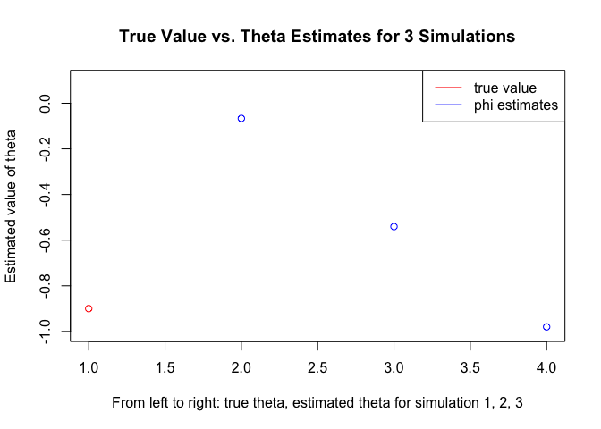
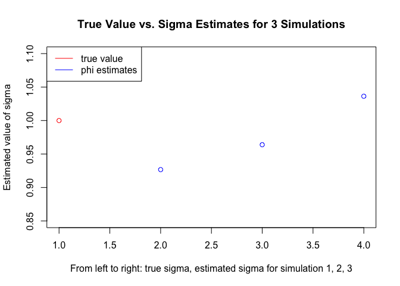
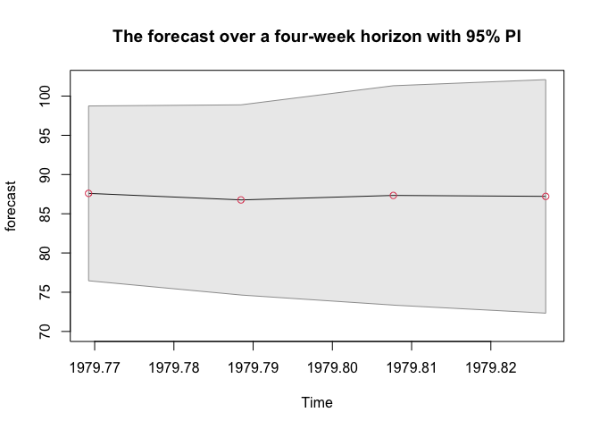

# Question 1
## (a)

```r
z1 <- c(1, -1.2, 0.85)
polyroot(z1) # find the roots 
```

```
## [1] 0.7058824+0.8235294i 0.7058824-0.8235294i
```

\newpage


```r
# calculate the ACF
h <- 0:10
acf_1 <- -1.0024*((1.0847)^(-h))*cos(0.8622*h+pi-atan(0.0695))
acf_1
```

```
##  [1]  0.99998781  0.64859385 -0.07166367 -0.63724590 -0.70372596 -0.30279315
##  [7]  0.23479135  0.53907892  0.44728856  0.07852714 -0.28593670
```

```r
# verify the ACF values using the ARMAacf function
ARMAacf(ar=c(1.2, -0.85), ma=0, 10) # AR(2) with phi1 = 1.2, phi2 = -0.85
```

```
##           0           1           2           3           4           5 
##  1.00000000  0.64864865 -0.07162162 -0.63729730 -0.70387838 -0.30295135 
##           6           7           8           9          10 
##  0.23475500  0.53921465  0.44751583  0.07868654 -0.28596460
```

By using the ARMAacf function to verify the ACF values, we can see that the values I calculated are very close to the output of ARMAacf.

## (b)

```r
z2 <- c(1, -1, 0.25)
polyroot(z2) # find the roots 
```

```
## [1] 2+0i 2-0i
```

By using the ARMAacf function to verify the ACF values, we can see that the values I calculated are very close to the output of ARMAacf.

# Question 2
## (a)
Given ARMA model: $x_t=0.9x_{t-1}+w_t-0.9w_{t-1} \ \text{with} \ w_t$ ~ iid N(0,1)

We have true coefficients: $\phi = 0.9$, $\theta = -0.9$


```r
# fit the model, plot the simulated data, compute the sample ACF and PACF
library(astsa)
library(tidyverse)
set.seed(299) # set seed to last 3 digits of my student id to get the same result each time
sim_result <- data.frame()
acfpacf <- list(data.frame())
for (i in 1:3){ # repeat the numeric exercise 3 times
  # generate 500 obs from the given ARMA model
  ARMA11 <- arima.sim(list(ar = 0.9, ma = -0.9), n = 500, sd = 1)
  # fit an ARMA(1,1) model to the data
  fit <- arima(ARMA11, order = c(1, 0, 1))
  # record the true parameters and the estimates
  sim_result <- rbind(sim_result, list("Simulation" = i, "true_phi" = 0.9,
                                       "est_phi" = round(fit$coef["ar1"], 4),
                                       "true_theta" = - 0.9,
                                       "est_theta" = round(fit$coef["ma1"], 4),
                                       "true_sd" = 1,
                                       "est_sd" = round(fit$sigma2, 4)))
  plot.ts(ARMA11) # plot the simulated data
  acf2(ARMA11, 30) # sample ACF and PACF
  acfpacf[[i]] <- round(acf2(ARMA11, 10, plot = FALSE), 4) %>%
    as.data.frame() %>%
    mutate(Simulation = i) %>%
    mutate(Lag = row_number()) %>%
    select(Simulation, Lag, ACF, PACF)
}
```

<!-- --><!-- --><!-- --><!-- --><!-- --><!-- -->

\newpage
## (b) What happened and how to explain the results?

The plots of the simulated data look different each time, and their ACF and PACF are also different for each simulation. According to the plots of ACF and PACF, the patterns are somewhat random with positive and negative values, but the values are quite small, with most of the values within the dashed lines (values are slightly larger at some lag, for example, lag = 20 for Sim 2, lag = 10 for Sim 3).

The table called "sim_result" (shown in part (a)) shows the true parameter values and the estimates for each simulation. We see that the parameter estimates are different each time. The ARMA11 dataset is simulated with randomness each time, and also the sample size is moderate (maybe not large enough), therefore leads to the difference in parameter estimates in each simulation and the difference with the true parameter.

Here are the first 10 values of ACF and PACF for each simulation:


```r
# Show the first 10 values of ACF and PACF for simulation 1
acfpacf[[1]]
```

```
##    Simulation Lag     ACF    PACF
## 1           1   1  0.0185  0.0185
## 2           1   2  0.0092  0.0089
## 3           1   3 -0.0619 -0.0623
## 4           1   4 -0.0439 -0.0418
## 5           1   5 -0.0014  0.0013
## 6           1   6  0.0339  0.0311
## 7           1   7  0.0003 -0.0061
## 8           1   8 -0.0296 -0.0323
## 9           1   9 -0.0024  0.0026
## 10          1  10  0.0289  0.0324
```

```r
# Show the first 10 values of ACF and PACF for simulation 2
acfpacf[[2]]
```

```
##    Simulation Lag     ACF    PACF
## 1           2   1  0.0660  0.0660
## 2           2   2  0.0740  0.0700
## 3           2   3 -0.0057 -0.0150
## 4           2   4 -0.0090 -0.0130
## 5           2   5  0.0354  0.0386
## 6           2   6 -0.0084 -0.0116
## 7           2   7  0.0092  0.0049
## 8           2   8  0.0451  0.0469
## 9           2   9  0.0306  0.0248
## 10          2  10  0.0359  0.0245
```

```r
# Show the first 10 values of ACF and PACF for simulation 3
acfpacf[[3]]
```

```
##    Simulation Lag     ACF    PACF
## 1           3   1 -0.0085 -0.0085
## 2           3   2  0.0744  0.0743
## 3           3   3 -0.0227 -0.0216
## 4           3   4  0.0104  0.0045
## 5           3   5  0.0071  0.0105
## 6           3   6  0.0340  0.0327
## 7           3   7 -0.0239 -0.0247
## 8           3   8 -0.0530 -0.0583
## 9           3   9 -0.0405 -0.0367
## 10          3  10  0.1395  0.1476
```

\newpage
## (a) Fit an ARMA(1,1) model to the data for each simulation. Plot the parameter estimates in each case with the true values on the same axis.

**The code for fitting the model is in the first chunk of Question 2, and here is a table summarizing the true values and estimated values of each parameter for all 3 simulations:**


```r
sim_result
```

```
##   Simulation true_phi est_phi true_theta est_theta true_sd est_sd
## 1          1      0.9  0.0852       -0.9   -0.0666       1 0.9267
## 2          2      0.9  0.6089       -0.9   -0.5405       1 0.9639
## 3          3      0.9  0.9873       -0.9   -0.9800       1 1.0363
```

### Plot the true values vs. parameter estimates for Simulation 1 on the same axis:

```r
# plot the true values vs. parameter estimates for Simulation 1
Sim1 <- data.frame(Parameters = c("phi","theta","sigma","phi","theta","sigma"),
                   Values = c(0.9, -0.9, 1, sim_result$est_phi[1],
                              sim_result$est_theta[1], sim_result$est_sd[1]),
                   Type = c("true", "true", "true", "estimated", "estimated", 
                            "estimated"))
Sim1 %>%
  # make the parameters in order: phi, theta, sigma
  mutate(Parameters = fct_relevel(Parameters, "sigma", after = Inf)) %>%
  ggplot(aes(x = Parameters, y = Values, colour = Type)) +
  geom_point() +
  # add a title
  labs(title = "True Values vs. Parameter Estimates for Simulation 1") + 
  theme_minimal()
```

<!-- -->

For Simulation 1, the estimated values of $\phi$ and $\theta$ are quite different from the true values, while the estimated $\sigma$ is close to the true $\sigma$.

\newpage
### Plot the true values vs. parameter estimates for Simulation 2 on the same axis:

```r
# plot the true values vs. parameter estimates for Simulation 2
Sim2 <- data.frame(Parameters = c("phi","theta","sigma","phi","theta","sigma"),
                   Values = c(0.9, -0.9, 1, sim_result$est_phi[2],
                              sim_result$est_theta[2], sim_result$est_sd[2]),
                   Type = c("true", "true", "true", "estimated", "estimated", 
                            "estimated"))
Sim2 %>%
  # make the parameters in order: phi, theta, sigma
  mutate(Parameters = fct_relevel(Parameters, "sigma", after = Inf)) %>%
  ggplot(aes(x = Parameters, y = Values, colour = Type)) +
  geom_point() +
  # add a title
  labs(title = "True Values vs. Parameter Estimates for Simulation 2") + 
  theme_minimal()
```

<!-- -->

For Simulation 2, the estimated values of $\phi$ and $\theta$ are still somewhat different from the true values, while the estimated $\sigma$ is close to the true $\sigma$.

\newpage
### Plot the true values vs. parameter estimates for Simulation 3 on the same axis:

```r
# plot the true values vs. parameter estimates for Simulation 3
Sim3 <- data.frame(Parameters = c("phi","theta","sigma","phi","theta","sigma"),
                   Values = c(0.9, -0.9, 1, sim_result$est_phi[3],
                              sim_result$est_theta[3], sim_result$est_sd[3]),
                   Type = c("true", "true", "true", "estimated", "estimated", 
                            "estimated"))
Sim3 %>%
  # make the parameters in order: phi, theta, sigma
  mutate(Parameters = fct_relevel(Parameters, "sigma", after = Inf)) %>%
  ggplot(aes(x = Parameters, y = Values, colour = Type)) +
  geom_point() +
  # add a title
  labs(title = "True Values vs. Parameter Estimates for Simulation 3") + 
  theme_minimal()
```

<!-- -->

For Simulation 3, the estimated values of $\phi$, $\theta$, and $\sigma$ are all close to the true values.

Another method to plot:

```r
# plot the estimates of phi for 3 simulations with the true value
plot(c(sim_result$true_phi[1], sim_result$est_phi[1],
       sim_result$est_phi[2], sim_result$est_phi[3]), type = "p",
     col = c("red", "blue", "blue", "blue"), ylim = c(0, 1),
     ylab = "Estimated value of phi",
     xlab = "From left to right: true phi, estimated phi for simulation 1, 2, 3",
     main = "True Value vs. Phi Estimates for 3 Simulations")
legend(x = "bottomright", legend = c("true value", "phi estimates"),
       col = c("red", "blue"), lty = c(1,1))
```

<!-- -->


```r
# plot the estimates of theta for 3 simulations with the true value
plot(c(sim_result$true_theta[1], sim_result$est_theta[1],
       sim_result$est_theta[2], sim_result$est_theta[3]), type = "p",
     col = c("red", "blue", "blue", "blue"), ylim = c(-1, 0.1),
     ylab = "Estimated value of theta",
     xlab = "From left to right: true theta, estimated theta for simulation 1, 2, 3",
     main = "True Value vs. Theta Estimates for 3 Simulations")
legend(x = "topright", legend = c("true value", "phi estimates"),
       col = c("red", "blue"), lty = c(1,1))
```

<!-- -->


```r
# plot the estimates of sigma for 3 simulations with the true value
plot(c(sim_result$true_sd[1], sim_result$est_sd[1],
       sim_result$est_sd[2], sim_result$est_sd[3]), type = "p",
     col = c("red", "blue", "blue", "blue"), ylim = c(0.85, 1.1),
     ylab = "Estimated value of sigma",
     xlab = "From left to right: true sigma, estimated sigma for simulation 1, 2, 3",
     main = "True Value vs. Sigma Estimates for 3 Simulations")
legend(x = "topleft", legend = c("true value", "phi estimates"),
       col = c("red", "blue"), lty = c(1,1))
```

<!-- -->

\newpage
# Question 3
## (a)


```r
library(astsa)
# fit an AR(2) model to the data
cmort_fit <- ar.ols(cmort, order = 2, demean = FALSE, intercept = TRUE)
cmort_fit
```

```
## 
## Call:
## ar.ols(x = cmort, order.max = 2, demean = FALSE, intercept = TRUE)
## 
## Coefficients:
##      1       2  
## 0.4286  0.4418  
## 
## Intercept: 11.45 (2.394) 
## 
## Order selected 2  sigma^2 estimated as  32.32
```

```r
cmort_fit$asy.se.coef # standard errors of the estimates
```

```
## $x.mean
## [1] 2.393673
## 
## $ar
## [1] 0.03979433 0.03976163
```

**According to the output, the fitted regression model is:** $x_t=11.45+0.4286x_{t-1}+0.4418x_{t-2}$

**Test the significance of the parameter estimates:**


```r
cmort_1 <- as.numeric(cmort)
cmort_fit1 <- lm(cmort_1 ~ lag(cmort_1, 1) + lag(cmort_1, 2)) # the model has order of 2
summary(cmort_fit1)
```

```
## 
## Call:
## lm(formula = cmort_1 ~ lag(cmort_1, 1) + lag(cmort_1, 2))
## 
## Residuals:
##      Min       1Q   Median       3Q      Max 
## -17.8192  -4.0339  -0.2112   3.4219  22.1840 
## 
## Coefficients:
##                 Estimate Std. Error t value Pr(>|t|)    
## (Intercept)     11.45061    2.40080   4.769 2.42e-06 ***
## lag(cmort_1, 1)  0.42859    0.03991  10.738  < 2e-16 ***
## lag(cmort_1, 2)  0.44179    0.03988  11.078  < 2e-16 ***
## ---
## Signif. codes:  0 '***' 0.001 '**' 0.01 '*' 0.05 '.' 0.1 ' ' 1
## 
## Residual standard error: 5.702 on 503 degrees of freedom
##   (2 observations deleted due to missingness)
## Multiple R-squared:  0.6752,	Adjusted R-squared:  0.6739 
## F-statistic: 522.8 on 2 and 503 DF,  p-value: < 2.2e-16
```

**Test the significance of the parameter estimates:**

Using this method to fit the AR(2) model will give us the same parameter estimates as the ar.ols method, and in addition, it gives the p-value of each estimated coefficient. According to the output, the p-value of the estimated intercept and the p-values of coefficients of the time series at lag 1 and 2 are all less than the significance level of 0.05, which means the parameter estimates are all significant. Moreover, the p-value of the overall model is < 2.2e-16, which indicates that the entire model is significant as well.

## (b)

```r
z_0.975 <- qnorm(0.975)
# find the forecasts over a four-week horizon, m = 1, 2, 3, 4
fore <- predict(cmort_fit, n.ahead = 4)
# construct 95% prediction intervals and show the results in a table
pre_int <- data.frame("m" = 1:4,
                      "forecast" = fore$pred,
                      "lower bound" = fore$pred - z_0.975*fore$se, 
                      "upper bound" = fore$pred + z_0.975*fore$se)
pre_int
```

```
##   m forecast lower.bound upper.bound
## 1 1 87.59986    76.45777    98.74196
## 2 2 86.76349    74.64117    98.88581
## 3 3 87.33714    73.35431   101.31997
## 4 4 87.21350    72.33079   102.09621
```

The forecasts over a four-week horizon and their corresponding 95% prediction intervals are shown in the table above. 


```r
# plot the forecast and corresponding 95% PI
ts.plot(fore$pred, col = 1, ylim = c(70, 102), ylab = "forecast",
main = "The forecast over a four-week horizon with 95% PI")
# the upper bound and the lower bound
U = fore$pred + z_0.975*fore$se; L = fore$pred - z_0.975*fore$se
xx = c(time(U), rev(time(U))); yy = c(L, rev(U))
# add the gray band which represents the 95% PI
polygon(xx, yy, border = 8, col = gray(0.6, alpha = 0.2))
lines(fore$pred, type = "p", col = 2)
```

<!-- -->

This is the plot of the forecast over a four-week horizon, the red points represent the forecast values, and the gray band represents the 95% prediction intervals.


